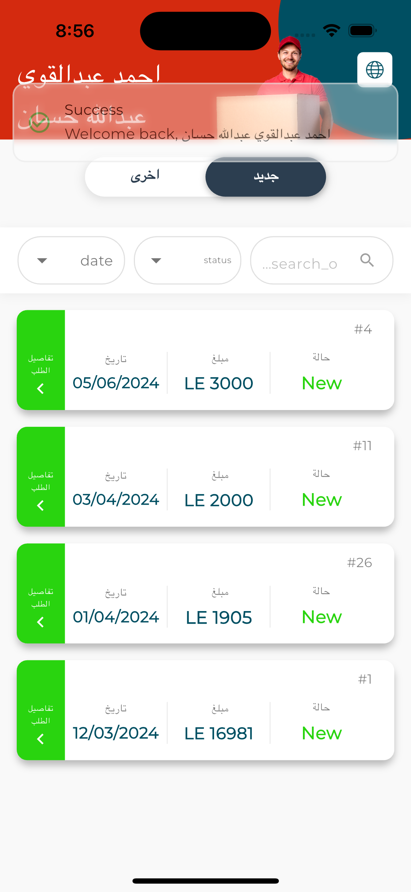

# Onyx Delivery

A Flutter-based mobile application for delivery management, featuring efficient order tracking, status management, and seamless offline capabilities.

## Features

- **Authentication System**: Secure login for delivery personnel
- **Order Management**: View and manage delivery orders
- **Dual-tab Interface**: Quickly switch between new and processed orders
- **Advanced Filtering**: Filter orders by status (new, delivered, returned)
- **Powerful Search**: Search orders by customer name, bill number, region, or address
- **Offline Capability**: Local database caching for offline operation
- **Multilingual Support**: Complete English and Arabic localization
- **Responsive Design**: Adapts to different screen sizes and orientations
## App Screenshots

<p align="center">
  
  
  
</p>

<p align="center">
  
  
  
</p>

## Technical Architecture

### Data Flow
1. Data is fetched from backend API
2. Saved to local SQLite database for offline access
3. SQL queries handle filtering directly at database level
4. UI updates with filtered data

### Tech Stack
- **State Management**: Flutter Cubit
- **Dependency Injection**: GetIt
- **Network Requests**: Dio
- **Local Database**: SQLite (sqflite)
- **Localization**: EasyLocalization
- **Responsive UI**: Flutter ScreenUtil

## Getting Started

### Prerequisites
- Flutter SDK (3.7.2+)
- Dart SDK (3.0.0+)
- Android Studio or VS Code with Flutter extensions

### Installation
1. Clone the repository
```bash
git clone https://github.com/yourusername/onyx-delivery.git
```

2. Install dependencies
```bash
flutter pub get
```

3. Run the app
```bash
flutter run
```

## Project Structure
```
lib/
├── core/
│   ├── constants/
│   ├── di/
│   └── utils/
├── features/
│   ├── login/
│   ├── order/
│   └── splash/
└── main.dart
```

## Database Schema
The app uses SQLite tables to store delivery bills, status types, and return reasons with proper relationships between them for efficient querying.

## API Integration
The app synchronizes with a backend API to:
- Fetch delivery orders
- Update order statuses
- Sync local changes when online

## Security Considerations
- Session management with auto-timeout
- Secure storage of user credentials
- Data validation before processing

## License
This project is proprietary and confidential.

## Contributors
- Development Team at Onyx Software Solutions
